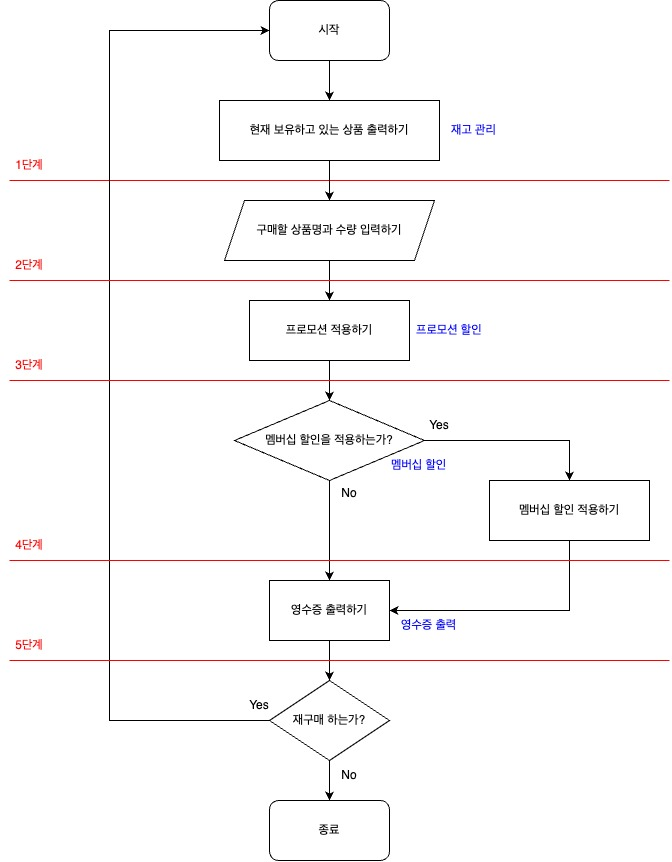
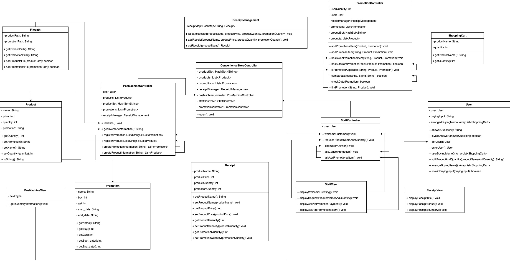

# java-convenience-store-precourse
## 기능 요구 사항
**구매자의 할인 혜택과 재고 상황을 고려하여 최종 결제 금액을 계산하고 안내하는 결제 시스템을 구현한다.
- 사용자가 입력한 상품의 가격과 수량을 기반으로 최종 결제 금액을 계산한다. 
  - 총 구매액은 상품별 가격과 수량을 곱하여 계산하며, 프로모션 및 멤버십 할인 정책을 반영하여 최종 결제 금액을 산출한다.
- 구매 내역과 산출한 금액 정보를 영수증으로 출력한다.
- 영수증 출력 후 추가 구매를 진행할지 또는 종료할지를 선택할 수 있다. 
- 사용자가 잘못된 값을 입력할 경우 `IllegalArgumentException`를 발생시키고, "[ERROR]"로 시작하는 에러 메시지를 출력 후 그 부분부터 입력을 다시 받는다.
  - `Exception`이 아닌 `IllegalArgumentException`, `IllegalStateException` 등과 같은 명확한 유형을 처리한다.**

### 재고 관리
- 각 상품의 재고 수량을 고려하여 결제 가능 여부를 확인한다. 
- 고객이 상품을 구매할 때마다, 결제된 수량만큼 해당 상품의 재고에서 차감하여 수량을 관리한다. 
- 재고를 차감함으로써 시스템은 최신 재고 상태를 유지하며, 다음 고객이 구매할 때 정확한 재고 정보를 제공한다.

### 프로모션 할인
- 오늘 날짜가 프로모션 기간 내에 포함된 경우에만 할인을 적용한다. 
- 프로모션은 N개 구매 시 1개 무료 증정(Buy N Get 1 Free)의 형태로 진행된다. 
- 1+1 또는 2+1 프로모션이 각각 지정된 상품에 적용되며, 동일 상품에 여러 프로모션이 적용되지 않는다. 
- 프로모션 혜택은 프로모션 재고 내에서만 적용할 수 있다. 
- 프로모션 기간 중이라면 프로모션 재고를 우선적으로 차감하며, 프로모션 재고가 부족할 경우에는 일반 재고를 사용한다. 
- 프로모션 적용이 가능한 상품에 대해 고객이 해당 수량보다 적게 가져온 경우, 필요한 수량을 추가로 가져오면 혜택을 받을 수 있음을 안내한다. 
- 프로모션 재고가 부족하여 일부 수량을 프로모션 혜택 없이 결제해야 하는 경우, 일부 수량에 대해 정가로 결제하게 됨을 안내한다.

### 멤버십 할인
- 멤버십 회원은 프로모션 미적용 금액의 30%를 할인받는다. 
- 프로모션 적용 후 남은 금액에 대해 멤버십 할인을 적용한다. 
- 멤버십 할인의 최대 한도는 8,000원이다.

### 영수증 출력
- 영수증은 고객의 구매 내역과 할인을 요약하여 출력한다. 
- 영수증 항목은 아래와 같다. 
  - 구매 상품 내역: 구매한 상품명, 수량, 가격 
  - 증정 상품 내역: 프로모션에 따라 무료로 제공된 증정 상품의 목록 
  - 금액 정보 
    - 총 구매액: 구매한 상품의 총 수량과 총 금액 
    - 행사 할인: 프로모션에 의해 할인된 금액 
    - 멤버십 할인: 멤버십에 의해 추가로 할인된 금액 
    - 내실 돈: 최종 결제 금액 
- 영수증의 구성 요소를 보기 좋게 정렬하여 고객이 쉽게 금액과 수량을 확인할 수 있게 한다.

## 입출력 요구 사항
### 입력
- 구현에 필요한 상품 목록과 행사 목록을 파일 입출력을 통해 불러온다. 
  - `src/main/resources/products.md`과 `src/main/resources/promotions.md` 파일을 이용한다.
  - 두 파일 모두 내용의 형식을 유지한다면 값은 수정할 수 있다. 
- 구매할 상품과 수량을 입력 받는다. 상품명, 수량은 하이픈(-)으로, 개별 상품은 대괄호([])로 묶어 쉼표(,)로 구분한다.
````
[콜라-10],[사이다-3]
````
- 프로모션 적용이 가능한 상품에 대해 고객이 해당 수량보다 적게 가져온 경우, 그 수량만큼 추가 여부를 입력받는다. 
  - Y: 증정 받을 수 있는 상품을 추가한다. 
  - N: 증정 받을 수 있는 상품을 추가하지 않는다.

````
Y
````
- 프로모션 재고가 부족하여 일부 수량을 프로모션 혜택 없이 결제해야 하는 경우, 일부 수량에 대해 정가로 결제할지 여부를 입력받는다. 
  - Y: 일부 수량에 대해 정가로 결제한다. 
  - N: 정가로 결제해야하는 수량만큼 제외한 후 결제를 진행한다.
````
Y
````
- 멤버십 할인 적용 여부를 입력 받는다. 
  - Y: 멤버십 할인을 적용한다. 
  - N: 멤버십 할인을 적용하지 않는다.
````
Y
````
- 추가 구매 여부를 입력 받는다. 
  - Y: 재고가 업데이트된 상품 목록을 확인 후 추가로 구매를 진행한다. 
  - N: 구매를 종료한다.
````
Y
````

### 출력
- 환영 인사와 함께 상품명, 가격, 프로모션 이름, 재고를 안내한다. 만약 재고가 0개라면 재고 없음을 출력한다.
````
안녕하세요. W편의점입니다.
현재 보유하고 있는 상품입니다.

- 콜라 1,000원 10개 탄산2+1
- 콜라 1,000원 10개
- 사이다 1,000원 8개 탄산2+1
- 사이다 1,000원 7개
- 오렌지주스 1,800원 9개 MD추천상품
- 오렌지주스 1,800원 재고 없음
- 탄산수 1,200원 5개 탄산2+1
- 탄산수 1,200원 재고 없음
- 물 500원 10개
- 비타민워터 1,500원 6개
- 감자칩 1,500원 5개 반짝할인
- 감자칩 1,500원 5개
- 초코바 1,200원 5개 MD추천상품
- 초코바 1,200원 5개
- 에너지바 2,000원 5개
- 정식도시락 6,400원 8개
- 컵라면 1,700원 1개 MD추천상품
- 컵라면 1,700원 10개

구매하실 상품명과 수량을 입력해 주세요. (예: [사이다-2],[감자칩-1])
````
- 프로모션 적용이 가능한 상품에 대해 고객이 해당 수량만큼 가져오지 않았을 경우, 혜택에 대한 안내 메시지를 출력한다.
````
현재 {상품명}은(는) 1개를 무료로 더 받을 수 있습니다. 추가하시겠습니까? (Y/N)
````
- 프로모션 재고가 부족하여 일부 수량을 프로모션 혜택 없이 결제해야 하는 경우, 일부 수량에 대해 정가로 결제할지 여부에 대한 안내 메시지를 출력한다.
````
현재 {상품명} {수량}개는 프로모션 할인이 적용되지 않습니다. 그래도 구매하시겠습니까? (Y/N)
````
- 멤버십 할인 적용 여부를 확인하기 위해 안내 문구를 출력한다.
````
멤버십 할인을 받으시겠습니까? (Y/N)
````
- 구매 상품 내역, 증정 상품 내역, 금액 정보를 출력한다.
````
===========W 편의점=============
상품명		수량	금액
콜라		3 	3,000
에너지바 		5 	10,000
===========증	정=============
콜라		1
==============================
총구매액		8	13,000
행사할인			-1,000
멤버십할인			-3,000
내실돈			 9,000
````
- 추가 구매 여부를 확인하기 위해 안내 문구를 출력한다.
````
감사합니다. 구매하고 싶은 다른 상품이 있나요? (Y/N)
````
- 사용자가 잘못된 값을 입력했을 때, "[ERROR]"로 시작하는 오류 메시지와 함께 상황에 맞는 안내를 출력한다. 
  - 구매할 상품과 수량 형식이 올바르지 않은 경우: `[ERROR] 올바르지 않은 형식으로 입력했습니다. 다시 입력해 주세요.` 
  - 존재하지 않는 상품을 입력한 경우: `[ERROR] 존재하지 않는 상품입니다. 다시 입력해 주세요.`
  - 구매 수량이 재고 수량을 초과한 경우: `[ERROR] 재고 수량을 초과하여 구매할 수 없습니다. 다시 입력해 주세요.`
  - 기타 잘못된 입력의 경우: `[ERROR] 잘못된 입력입니다. 다시 입력해 주세요.`

### 실행 결과 예시
````
안녕하세요. W편의점입니다.
현재 보유하고 있는 상품입니다.

- 콜라 1,000원 10개 탄산2+1
- 콜라 1,000원 10개
- 사이다 1,000원 8개 탄산2+1
- 사이다 1,000원 7개
- 오렌지주스 1,800원 9개 MD추천상품
- 오렌지주스 1,800원 재고 없음
- 탄산수 1,200원 5개 탄산2+1
- 탄산수 1,200원 재고 없음
- 물 500원 10개
- 비타민워터 1,500원 6개
- 감자칩 1,500원 5개 반짝할인
- 감자칩 1,500원 5개
- 초코바 1,200원 5개 MD추천상품
- 초코바 1,200원 5개
- 에너지바 2,000원 5개
- 정식도시락 6,400원 8개
- 컵라면 1,700원 1개 MD추천상품
- 컵라면 1,700원 10개

구매하실 상품명과 수량을 입력해 주세요. (예: [사이다-2],[감자칩-1])
[콜라-3],[에너지바-5]

멤버십 할인을 받으시겠습니까? (Y/N)
Y 

===========W 편의점=============
상품명		수량	금액
콜라		3 	3,000
에너지바 		5 	10,000
===========증	정=============
콜라		1
==============================
총구매액		8	13,000
행사할인			-1,000
멤버십할인			-3,000
내실돈			 9,000

감사합니다. 구매하고 싶은 다른 상품이 있나요? (Y/N)
Y

안녕하세요. W편의점입니다.
현재 보유하고 있는 상품입니다.

- 콜라 1,000원 7개 탄산2+1
- 콜라 1,000원 10개
- 사이다 1,000원 8개 탄산2+1
- 사이다 1,000원 7개
- 오렌지주스 1,800원 9개 MD추천상품
- 오렌지주스 1,800원 재고 없음
- 탄산수 1,200원 5개 탄산2+1
- 탄산수 1,200원 재고 없음
- 물 500원 10개
- 비타민워터 1,500원 6개
- 감자칩 1,500원 5개 반짝할인
- 감자칩 1,500원 5개
- 초코바 1,200원 5개 MD추천상품
- 초코바 1,200원 5개
- 에너지바 2,000원 재고 없음
- 정식도시락 6,400원 8개
- 컵라면 1,700원 1개 MD추천상품
- 컵라면 1,700원 10개

구매하실 상품명과 수량을 입력해 주세요. (예: [사이다-2],[감자칩-1])
[콜라-10]

현재 콜라 4개는 프로모션 할인이 적용되지 않습니다. 그래도 구매하시겠습니까? (Y/N)
Y

멤버십 할인을 받으시겠습니까? (Y/N)
N

===========W 편의점=============
상품명		수량	금액
콜라		10 	10,000
===========증	정=============
콜라		2
==============================
총구매액		10	10,000
행사할인			-2,000
멤버십할인			-0
내실돈			 8,000

감사합니다. 구매하고 싶은 다른 상품이 있나요? (Y/N)
Y

안녕하세요. W편의점입니다.
현재 보유하고 있는 상품입니다.

- 콜라 1,000원 재고 없음 탄산2+1
- 콜라 1,000원 7개
- 사이다 1,000원 8개 탄산2+1
- 사이다 1,000원 7개
- 오렌지주스 1,800원 9개 MD추천상품
- 오렌지주스 1,800원 재고 없음
- 탄산수 1,200원 5개 탄산2+1
- 탄산수 1,200원 재고 없음
- 물 500원 10개
- 비타민워터 1,500원 6개
- 감자칩 1,500원 5개 반짝할인
- 감자칩 1,500원 5개
- 초코바 1,200원 5개 MD추천상품
- 초코바 1,200원 5개
- 에너지바 2,000원 재고 없음
- 정식도시락 6,400원 8개
- 컵라면 1,700원 1개 MD추천상품
- 컵라면 1,700원 10개

구매하실 상품명과 수량을 입력해 주세요. (예: [사이다-2],[감자칩-1])
[오렌지주스-1]

현재 오렌지주스은(는) 1개를 무료로 더 받을 수 있습니다. 추가하시겠습니까? (Y/N)
Y

멤버십 할인을 받으시겠습니까? (Y/N)
Y

===========W 편의점=============
상품명		수량	금액
오렌지주스		2 	3,600
===========증	정=============
오렌지주스		1
==============================
총구매액		2	3,600
행사할인			-1,800
멤버십할인			-0
내실돈			 1,800

감사합니다. 구매하고 싶은 다른 상품이 있나요? (Y/N)
N
````

## 예외 상황
- 재고 관리(사용자 입력 전 -> 종료)
  - `products.md` 파일을 찾지 못했을 경우
  - `promotions.md` 파일을 찾지 못했을 경우
  - `products.md` 파일이 올바른 형식으로 되어있지 않을 경우
  - `promotions.md` 파일이 올바른 형식으로 되어있지 않을 경우
- 구매(사용자 입력)
  - 구매할 상품과 수량 형식이 올바르지 않은 경우
  - 존재하지 않는 상품을 입력한 경우
  - 구매 수량이 재고 수량을 초과한 경우
  - 기타 잘못된 입력의 경우

## 기능 구현 목록
- initialize
  - 편의점 POS 프로그램을 실행시킨다.
- hasProductsFile
  - `products.md` 파일이 존재하는지 확인한다.
- hasPromotionsFile
  - `promotions.md` 파일이 존재하는지 확인한다.
- createProductInformation
  - 재고를 확인한다.
- registerProduct
  - 재고를 등록한다.
- createPromotionInformation
  - 프로모션을 확인한다.
- registerPromotion
  - 프로모션을 등록한다.
- welcomeCustomer
  - 손님이 들어와서 환영한다.
- displayWelcomeGreeting
  - 편의점 환영인사를 출력한다.
- getInventoryInformation
  - 재고 정보를 가져온다.
- displayInventoryInformation
  - 재고 정보를 출력한다.
- requestProductNameAndQuantity
  - 구매할 상품과 수량을 입력 받는다.
- isValidBuyingInput
  - 사용자의 입력 문자열이 올바른 구매 입력 형식인지 확인한다.
- arrangeBuyingItems
  - 구매할 상품을 List로 정리한다.
- splitProductAndQuantity
  - 하이픈(-)을 기준으로 상품명과 수량을 구분한다.
- findPromotionProduct
  - 구매할 상품 중 프로모션 제품이 있는지 확인한다.
- meetsPromotionCriteria
  - 프로모션 적용 수량을 충족하는지 확인한다.
- applyPromotion
  - 프로모션을 적용한다.

## 로직
1. 편의점 환영인사 출력하기
2. 현재 보유하고 있는 상품 재고 출력하기
3. 구매할 상품명과 수량 입력하기
   1. 프로모션 적용이 가능한 상품이 있는데, 해당 수량만큼 가져오지 않았을 경우 혜택에 대한 안내 메시지 출력
   2. 프로모션 재고가 부족하여 일부 수량을 프로모션 혜택 없이 결제해야 하는 경우, 정가로 결제할지에 대한 안내 메시지 출력
4. 멤버십 할인 적용 유무 입력하기
5. 영수증 출력하기
6. 재구매 여부 입력하기
7. 재구매 하지 않는다면 종료하기

## 순서도



## 클래스 다이어그램


## 디렉토리 구조

````
````